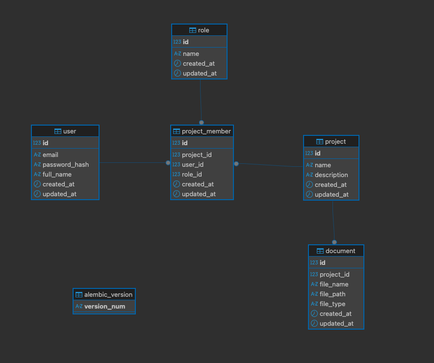

# Project Manager API

A RESTful backend API for project and document management, built with **FastAPI** following a layered architecture (**Router → Service → Repository**).

The application provides JWT authentication, role-based authorization, project collaboration, document management, and pluggable storage strategies (Local or AWS S3).

---

# Features

- User registration and authentication
- JWT-based authentication
- Project CRUD operations
- Project membership management
- Role-based authorization (Owner / Participant)
- User invitation by email
- Document upload and deletion
- Local and AWS S3 file storage using the Strategy Pattern
- Unit testing with Pytest
- Code quality checks with Ruff
- GitHub Actions CI pipeline
- Pre-commit hooks
- Docker support

---

# Architecture

The project follows a layered architecture:

```
                HTTP Request
                     │
                     ▼
                Router Layer
                     │
                     ▼
               Service Layer
                     │
                     ▼
             Repository Layer
                     │
                     ▼
                PostgreSQL
```

Each layer has a single responsibility:

- **Router:** Handles HTTP requests and responses.
- **Service:** Contains business logic and coordinates repositories.
- **Repository:** Encapsulates database access.
- **Database:** Persists application data.

---

# Entity Relationship Diagram



# Design Principles

This project applies several software engineering principles and design patterns:

- SOLID Principles
- Repository Pattern
- Strategy Pattern
- Dependency Injection
- Layered Architecture

---

# Tech Stack

- Python 3.12
- FastAPI
- SQLAlchemy 2.0
- PostgreSQL
- Alembic
- Pydantic
- JWT Authentication
- Passlib + Argon2
- AWS S3
- Docker
- Poetry
- Pytest
- Ruff
- GitHub Actions

---

# Project Structure

```
app/
├── core/
    ├── database/
    └── storage/
├── models/
├── repositories/
├── routers/
├── schemas/
├── services/
└── main.py

tests/
├── repositories/
├── routers/
└── services/
```

---

# Installation

Clone the repository

```bash
git clone https://github.com/<your-username>/project-manager-api.git

cd project-manager-api
```

Install dependencies

```bash
poetry install
```

Activate the virtual environment

```bash
poetry shell
```

---

# Environment Variables

Create a `.env` file in the project root.

```env
DATABASE_URL=
SECRET_KEY=
ALGORITHM=
ACCESS_TOKEN_EXPIRE_MINUTES=
STORAGE_PROVIDER=local
```

For AWS S3 support:

```env
AWS_ACCESS_KEY_ID=
AWS_SECRET_ACCESS_KEY=
AWS_REGION=
AWS_BUCKET_NAME=
```

---

# Database Migration

Run Alembic migrations:

```bash
poetry run alembic upgrade head
```

---

# Running the Application

## Using Poetry

```bash
poetry run uvicorn app.main:app --reload
```

## Using Docker

Build and start the containers:

```bash
docker compose up --build
```

The API documentation will be available at:

```
http://localhost:8000/docs
```

ReDoc documentation:

```
http://localhost:8000/redoc
```

---

# Running Tests

```bash
poetry run pytest
```

---

# Code Quality

Run Ruff linting

```bash
poetry run ruff check .
```

Format the project

```bash
poetry run ruff format .
```

Run all pre-commit hooks

```bash
pre-commit run --all-files
```

---

# File Storage

The application uses the **Strategy Pattern** to abstract file storage.

Available implementations:

- LocalStorageStrategy
- S3StorageStrategy

The active strategy is selected through the environment variable:

```env
STORAGE_PROVIDER=local
```

or

```env
STORAGE_PROVIDER=s3
```

This allows switching storage providers without modifying the business logic.

---

# Continuous Integration

A GitHub Actions workflow runs automatically on every **push** and **pull request** targeting the `develop` and `main` branches.

The pipeline performs:

- Dependency installation
- Ruff linting
- Ruff formatting check
- Unit tests

---

# Author

**Simon Lema**
